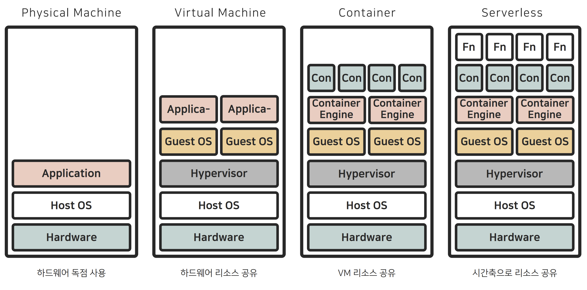
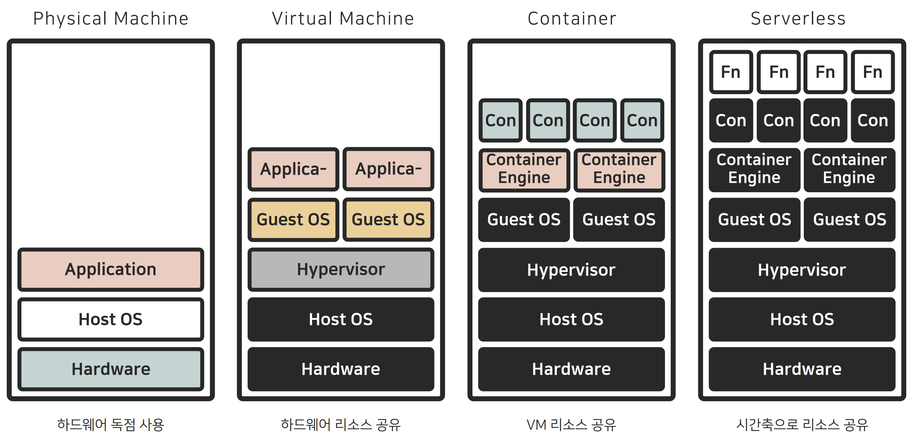
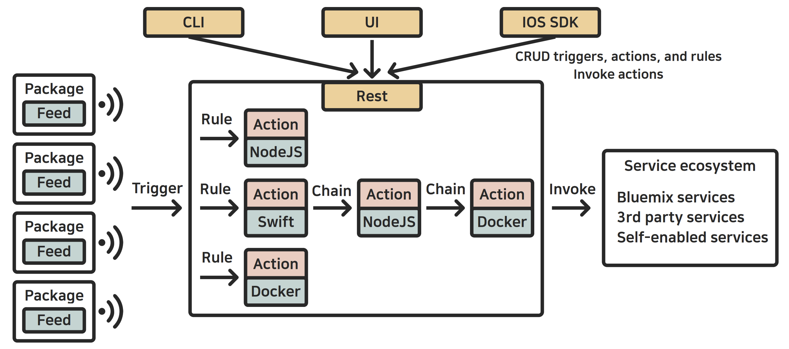
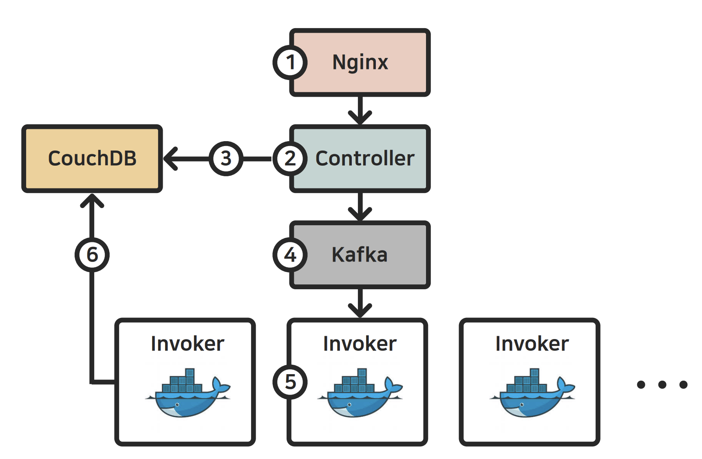

# ms 단위의 Serverless World에서 Docker의 성능 한계 극복하기

## About

> 이 세션에서는 Docker가 Serverless computing에서 야기할 수 있는 성능 이슈 및 이를 해결한 경험과 노하우를 공유합니다.
> 
> Docker 데몬이 가진 성능 상의 이슈가 어떤 것인지, Apache OpenWhisk에서는 이 이슈가 어떻게 전체 성능에 영향을 미치는지, 유사한 문제를 해결하는 전통적인 방식들이 왜 Serverless Computing에는 적용하기 어려운지, 그리고 이 문제를 해결하고, 오픈소스에 컨튜리뷰션 하는 과정에서 겪은 경험 및 노하우 등을 공유 드립니다.

발표자: 김동경 / NAVER / PaaS

## Content

### 1. Serverless Computing이란 무엇인가

* 요즘 Serverless에 대한 관심이 굉장히 높다. (가장 트렌드)
* Serverless에 대한 많은 컨퍼런스와 기술들이 나오고 있다.
* Serverless 자체로 서비스를 만들어 운영하는 서비드들도 많다.
  * Auth0 - 인증
  * Puresec - 보안
  * Trigger Mesh - 앱 관리
  * Lumigo - 모니터링
  * nuclio - Data Science

### Cloud의 진화 과정

### Serverless의 종류

* BaaS (Backend as a Service), DaaS (Database as a Service), FaaS (Function as a Service), ... 
* AWS 사이트만 봐도 어마어마하게 많다.
* 오늘은 FaaS에 대해서만 설명한다.

### 2. Apache Openwhisk - OpenSource Serverless Platform

#### What is Apach OpenWhisk?

#### How to work?

#### 액션의 형태

1. Cold start
   * 동작 순서
     * 컨테이너 생성
     * 코드 초기화
     * 코드 실행
   * 300ms ~ 이상 걸린다.
   * 
2. Prewarmed start
   * 동작 순서
     * 코드 초기화
     * 코드 실행
   * 컨테이너는 이미 생성됐기 때문에 50 ~ 100ms 정도 걸린다.
3. Warmed start
   * 동작 순서
     * 코드 실행
   * 코드만 실행하면 되기 때문에 3 ~ 5ms 정도 걸린다.

#### OpenWhisk에서 스케쥴링의 의미

* 액션 실행 요청을 어떤 Invoker에게 보낼지 결정
* 이미 구동되어 있는 컨테이너를 재사용 하는 것이 스케쥴링의 핵심

#### Optimal한 스케쥴링이 불가능한 이유

* 컨테이너의 상태는 2ms마다 변한다.
* 스케쥴링 시점과 컨테이너 상태의 시점을 맞춰야 한다.
  * 모든 Invoker로부터 실시간으로 리소스 정보를 수집한다.
  * 다른 Controller의 스케쥴링을 고려해야한다.
  * 최적의 위치로 실행 요청을 전송해야 한다.
  * 이 모든 과정이 2ms 이내에 이루어져야 한다....?

#### ApacheOpenWhisk의 스케쥴링방식

1. 액션의 위치를 미리 정해둔다.
   1. Hash 함수를 통해 액션의 위치를 결정한다.
   2. Hash(a1)=HomeInvoker
   3. 컨테이너의 위치를 고려할 필요가 없음
2. 각 컨트롤러가 리소스를 나누어 가진다.
   1. Invoker의 리소스 / Controller의 수

### 3. Docker의 성능이 OpenWhisk에 미치는 영향

#### Docker daemon 벤치마크 결과

> run - rm: 500ms ~ 1300ms
>
> pause - unpause: 50ms ~ 400ms
>
> Daemon이 요청을 sequential하게 처리

##### 이유는 ?

###### 액션간의 간섭이 존재하는 경우

1. 시뮬레이션
   * 액션 실행 시 마다 컨테이너의 삭제와 생성이 발생한다.
   * 다른 Invoker들은 idle한 상태
2. 1300ms가 걸리는 이유
   * 액션의 실행시간: 2ms 
   * 컨테이너 생성 삭제: 500ms~1300ms
   * 실제 실행시간: 2ms + 1300ms = 1302ms
3. 액션간의 간섭으로 인해 최대 650배 가량 느려졌다.
4. 이후 모든 실행도 함께 느려진다.

###### 앞서 실행을 기다리지 않는 경우

1. 시뮬레이션
   * 요청이 오면 컨테이너 생성
   * 코드 초기화
   * 코드 실행
2. 스케쥴링을 하지 않고 기다린다.
3. 실행시간 <= 500ms 인 경우, ColdStart보다 이전 실행을 기다리는 것이 낫다.

###### 시스템의 성능 결정 불가

1. 시뮬레이션

   1. 100명의 유저가 1개 액션 사용 = 20,000TPS
   2. 100명의 유저가 10개 액션 사용 = 6,000TPS
   3. 100명의 유저가 100개 액션 사용 = 30TPS
   4. 100명의 유저가 10개 액션 사용 = 6,000TPS
   5. 200명의 유저가 10개 액션 사용 = 2,400TPS
   6. 750명의 유저가 100개 액션 사용 = 30TPS

2. 동일한 환경에서도 실행되는 액션의 수와 실행하는 유저의 수에 따라 성능이 달라진다.

3. 언제 Scale-out할지, 얼마나 서버를 늘릴지 결정 불가하다.

4. 즉 Resource Planning 불가하다.

   

### 4. 성능 이슈를 극복한 방법

#### 성능 이슈 극복하기

1. 액션 별로 별도의 큐를 사용
   * 액션 별 메시지 큐 도입
     * 한 액션의 지연이 다른 액션에 양향을 주지 않음
   * Pull 기반 스케쥴링
     * 컨테이너의 위치를 신경쓰지 않아도 됨
     * 컨테이너의 재사용률이 최대가 됨
2. 액션의 실행과 컨테이너의 생성을 분리
   * 컨테이너의 생성이 기존 실행에 영향을 주지 않음
3. 신규 컴포넌트 도입
   * ETCD 이용
     * 각 컨트롤러는 자신에게 할당된 리소스 기준으로 스케쥴링
     * ETCD에 주기적으로 리소스 상태 기록
     * 컨테이너 생성 전 분산 트랜잭션
   * Scheduler 이용
     * Kafka를 대체하는 큐를 직접 구현
       * 실행요청에 대한 메시지 큐 역할
       * 컨테이너의 생성 시점을 결정
       * Routing에 대한 Full Control을 가짐
     * Kafka를 쓰지 못한 이유
       * Kafka 토픽은 파티션으로 이루어짐
       * 파티션은 parallelism의 단위
       * 컨슈머 수와 동일한 수의 파티션 필요
       * 파티션은 동적으로 변경이 어려움
         * 변경 시 수초간 단절 발생
         * 미리 충분히 크게 늘려 놓아야 함
       * 특정 파티션을 특정 컨슈머에게 할당
         * Consumer Rebalancing
         * Consumer(컨테이너)가 추가될 때 마다 발생
         * 컨슈머 개수에 비례한 시간이 걸림
         * 파티션 200개를 Rebalancing하는데 50초 이상 소요
         * Routing(Rebalancing)을 우리가 결정할 수 없음

#### 결론

###### 요약

1. 액션별 메시지 큐 도입
   * 액션간 간섭 문제 해결
2. Pull 기반 메시지 전송
   * 컨테이너의 위치를 고려하지 않음
3. 액션의 실행과 컨테이너의 생성을 분리
   * 컨테이너 생성이 실행을 지연시키지 않음
4. ETCD 기반으로 리소스 공유 및 분산 트랜잭션
   * 리소스를 글로벌하게 관리
5. 스케쥴러 컴포넌트 구현
   * Routing에 대한 Full Control 가짐

###### 성능 비교 벤치마크

* 오픈소스: 90TPS

* 신규 스케쥴러: 14,000 TPS

* 즉 155배 차이!

  

### 5. 기타 - 오픈소스 컨트리뷰션 및 Committer 자격 확보 경험

* Tech Interchange Call
  * 전세계 커뮤니티 멤버들의 화상회의
  * 매 2주마다 진행
  * 이슈나 신규 기술 등을 공유
*  신규스케쥴링proposal공유
* 신규 스케쥴러 구현
* Apache Committer/PMC 자격 획득
* Naver Cloud Platform - Cloud Functions 개발

## Review

처음 예상했던 내용의 흐름과 많이 달라 당황했다.

Docker 데몬이 가진 성능 상의 이슈가 어떤 것인지 설명하는 것 까진 맞았으나,

Apache OpenWhisk가 너무 주된 내용이 되버렸다. ㅠㅠ

해결 방법도 자세히 설명해주셨는데 나 혼자선 도저히 감당이 안되는 규모인 것 같다...

내용은 좋았으나 적용하지 못하는게 너무 슬프다.
